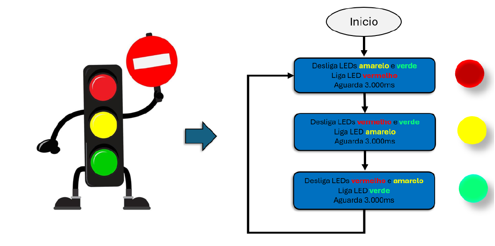
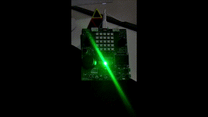

---

<table>
  <tr>
    <td>
      
    </td>
    <td>
      <h1>🚦 Semáforo com Temporizador Periódico</h1>
    </td>
  </tr>
</table>

## 📋 Descrição Geral

Este projeto implementa um **semáforo com temporização periódica** utilizando o microcontrolador **Raspberry Pi Pico W** e a função `add_repeating_timer_ms()` do **Pico SDK**. O sistema alterna entre os estados do semáforo (vermelho, amarelo e verde) a cada **3 segundos**.  
Além disso, a aplicação conta com um **LED RGB**, que simula os sinais do semáforo alterando suas cores conforme a configuração dos GPIOs na BitDogLab.

---

## 🎯 Objetivos

- **Temporizador Periódico:** Utilizar `add_repeating_timer_ms()` para alternar os estados do semáforo a cada 3.000 ms.
- **Controle de LEDs Individuais:** Gerenciar três LEDs (vermelho, amarelo e verde) que, inicialmente, iniciam na cor vermelha e mudam conforme o fluxo do semáforo.
- **Impressão na Serial:** Exibir mensagens de status a cada 1 segundo na porta serial.
- **LED RGB na BitDogLab:** Implementar a funcionalidade usando um LED RGB (GPIOs 11, 12 e 13), onde, na BitDogLab, os mapeamentos são: GPIO 11 - LED Verde, GPIO 12 - LED Azul e GPIO 13 - LED Vermelho.
- **Simulação e Validação:** Simular o sistema no Wokwi e validar a implementação antes da execução na placa BitDogLab.
- **Fluxograma Simplificado:** Seguir o fluxograma simplificado de atuação do semáforo (Figura 1) conforme orientação do material de apoio.

---

## 🛠 Componentes Utilizados

- **Raspberry Pi Pico W** (Microcontrolador)
- **03 LEDs (vermelho, amarelo e verde)**
- **03 Resistores de 330 Ω**
- **LED RGB** (utilizando GPIOs 11, 12 e 13 para as cores, considerando a mapeamento da BitDogLab)

---

## 📂 Estrutura do Projeto

```plaintext
Semaforo/
├── assets
│   ├── fluxograma.jpeg
│   ├── logo.jpeg
│   ├── placa.gif
│   └── wokwi.gif
├── wokwi
│   ├── diagram.json
│   └── wokwi.toml
├── .gitignore
├── CMakeLists.txt
├── LICENSE
├── main.c
├── pico_sdk_import.cmake
└── README.md
```

---

Aqui está a seção **Funcionalidades do Projeto** com a imagem do fluxograma inserida corretamente e contextualizada:

---

## 🚀 Funcionalidades do Projeto

1. **Estados do Semáforo:**

   - **Vermelho:** Inicia com o LED vermelho aceso.
   - **Amarelo:** Após 3 segundos, o LED vermelho apaga e o amarelo acende.
   - **Verde:** Depois de mais 3 segundos, o LED amarelo apaga e o verde acende.
   - **Loop:** O ciclo se repete indefinidamente, conforme o fluxograma simplificado abaixo.

2. **Temporização e Serial:**

   - O temporizador é configurado com `add_repeating_timer_ms()` para realizar a troca de estado dos LEDs a cada 3 segundos.
   - A rotina principal imprime uma mensagem na porta serial a cada 1 segundo, informando o status do semáforo.

3. **Execução com LED RGB:**
   - O LED RGB substitui os três LEDs individuais, utilizando os GPIOs 11, 12 e 13, conforme o mapeamento da BitDogLab (GPIO 11: Verde, GPIO 12: Azul, GPIO 13: Vermelho).

### Fluxograma da Atividade

O fluxograma abaixo ilustra o funcionamento do semáforo, mostrando a alternância entre os estados (vermelho, amarelo e verde) e o loop contínuo:

<p align="center">
  
</p>

---

## 🔧 Requisitos Técnicos

- **Temporização Precisa:** Configuração correta de `add_repeating_timer_ms()` para a troca dos estados.
- **Call-back de Alteração dos LEDs:** Implementação na função `repeating_timer_callback()` para atualizar o sinal do semáforo.
- **Mensagens na Serial:** Impressão de status a cada 1.000 ms dentro da rotina principal (loop while).
- **Código Organizado e Comentado:** Facilitar a manutenção e compreensão do fluxo.

---

## ⚙️ Instalação e Execução

### 1. Configuração do Ambiente

- Certifique-se de que o **Pico SDK** está instalado e configurado corretamente.
- Verifique se todas as dependências necessárias para a compilação estão instaladas.

### 2. Clonando o Repositório

```bash
git clone https://github.com/otilianojunior/temporizador-periodico.git
```

### 3. Compilando e Enviando o Código

```bash
mkdir build
cd build
cmake ..
make
```

Após a compilação, copie o arquivo `.uf2` gerado para o Raspberry Pi Pico W (certifique-se de que a placa esteja no modo bootloader).

---

## 🔍 Testes

- **Simulação no Wokwi:**

  - Utilize o arquivo `diagram.json` na pasta `wokwi` para testar o funcionamento.
  - Acesse também a simulação online: [Wokwi](https://wokwi.com/projects/421750772869007361)

  <p align="center">
    
  </p>

- **Execução na Placa BitDogLab:**

  - Após gerar o `.uf2`, copie-o para o Raspberry Pi Pico W e valide o funcionamento do semáforo.

  <p align="center">
    
  </p>

- **Demonstração em Vídeo:**
  > 🎥 **Assista ao vídeo demonstrativo:** [Clique aqui para assistir](https://drive.google.com/file/d/1potrEsFfaE2XqKdHTtl_CRhAGqBc4isG/view?usp=sharing)

---

## ✅ Conclusão

Este projeto demonstra de forma prática a utilização de temporização periódica em microcontroladores, aplicando conceitos como **interrupção por timer**, **controle de LEDs** e **impressão na serial**. A implementação, que abrange tanto a utilização de LEDs individuais quanto de um **LED RGB** (adaptado para a BitDogLab), amplia a compreensão sobre a manipulação de saídas digitais e a integração de hardware e software.

---

_Desenvolvido por Otiliano Junior_

---
